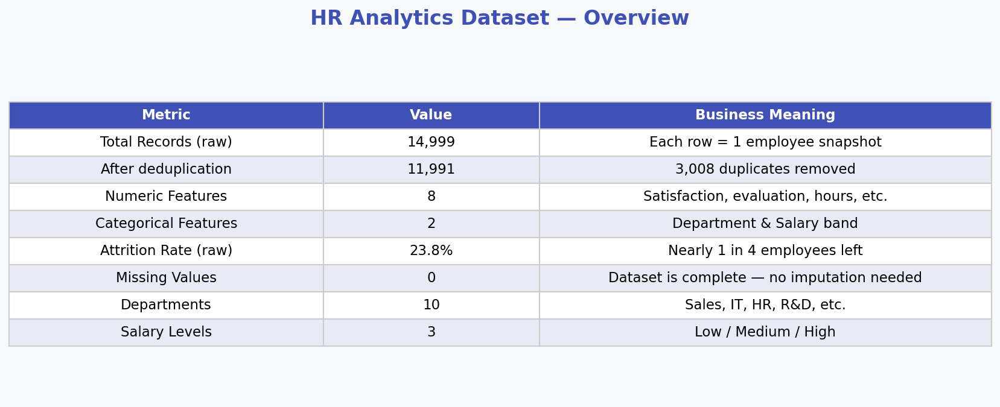
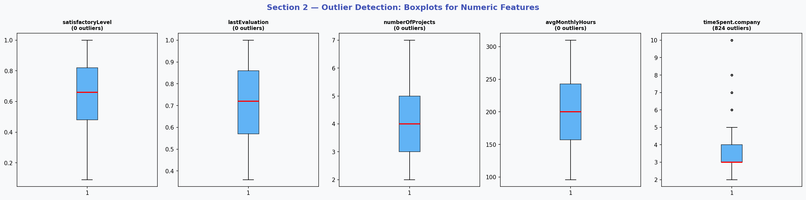
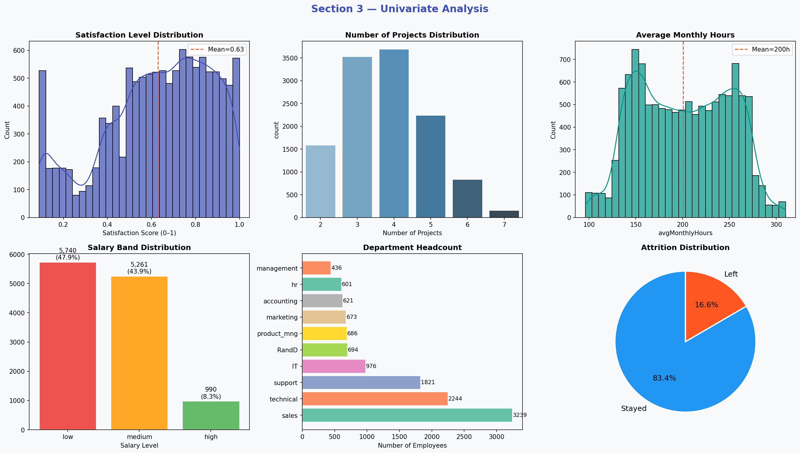
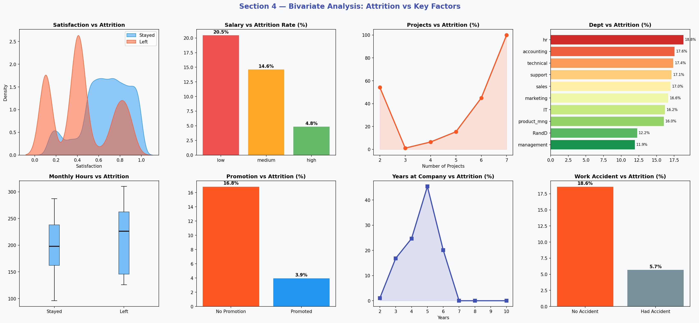
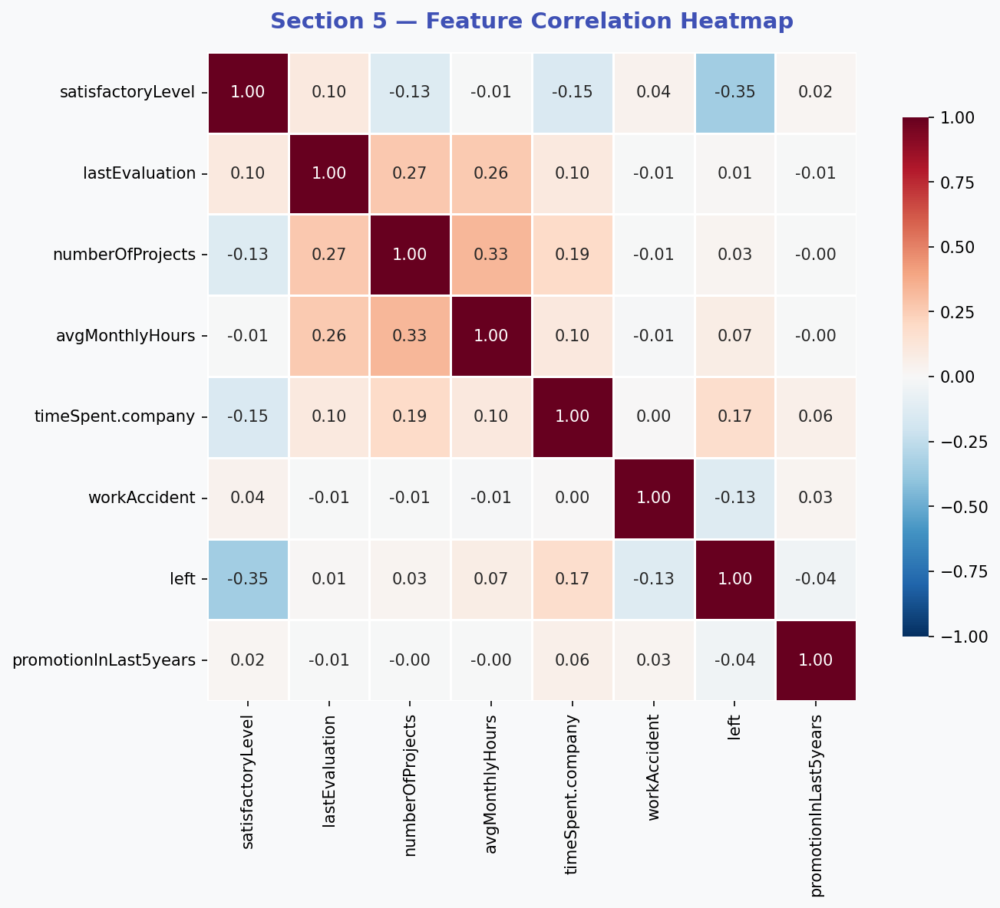
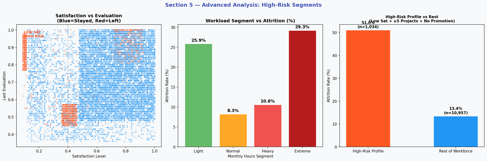
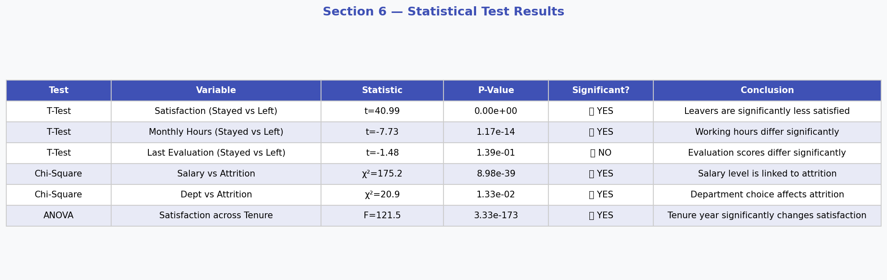
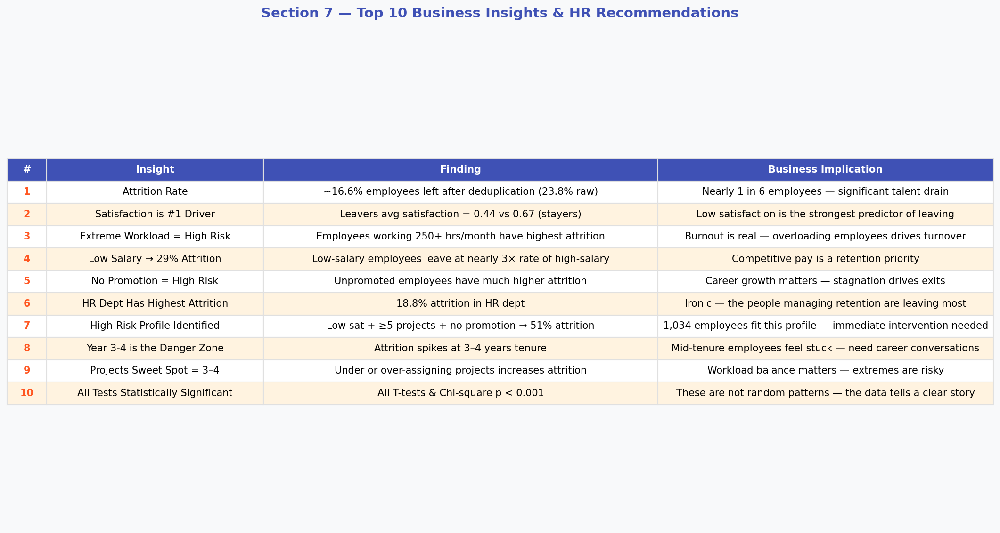

# 📊 HR Analytics — Employee Attrition Analysis

## 📌 Overview
Complete Exploratory Data Analysis on an HR dataset of ~15,000 employees to identify key drivers of employee attrition using Python.

## 📂 Dataset
- **Total Employees:** 14,999 | After dedup: 11,991
- **Attrition Rate:** ~23.8%
- **Features:** satisfaction, evaluation, projects, hours, salary, department, tenure, promotion

## 🔍 EDA Visualizations

### 1. Dataset Overview


### 2. Outlier Detection


### 3. Univariate Analysis


### 4. Bivariate Analysis


### 5. Correlation Heatmap


### 6. Advanced Analysis & High-Risk Segments


### 7. Statistical Tests (T-test, Chi-square, ANOVA)


### 8. Top 10 Business Insights


## 🔥 Key Findings
- Low satisfaction is the **#1 attrition driver** (t = 40.98, p < 0.001)
- Low-salary employees leave at **4× the rate** of high-salary employees
- **High-risk profile** (low sat + ≥5 projects + no promotion) = **51% attrition**
- Year **3–4 tenure** is the danger zone for mid-career exits
- HR department itself has the **highest attrition (18.8%)**

## 🛠️ Tools Used
Python · Pandas · NumPy · Matplotlib · Seaborn · SciPy

## 🚀 How to Run
```bash
pip install pandas numpy matplotlib seaborn scipy
jupyter notebook HR_analytics.ipynb
```